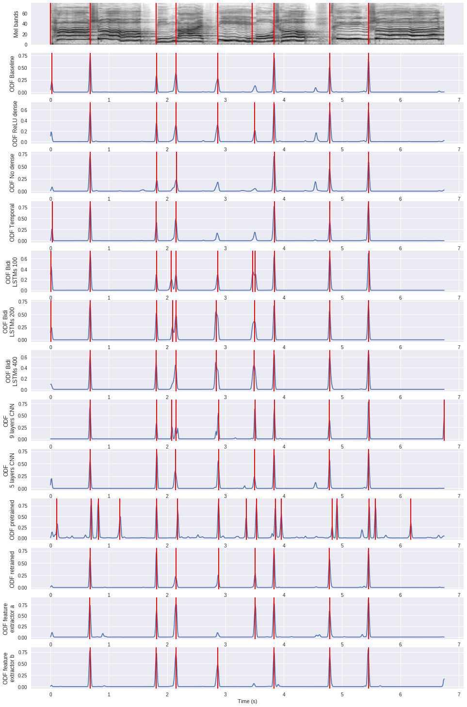
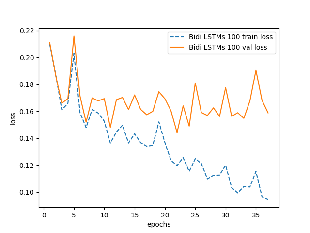
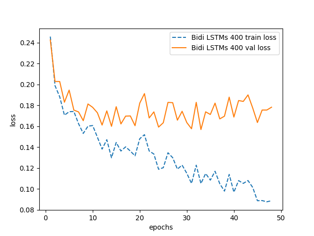
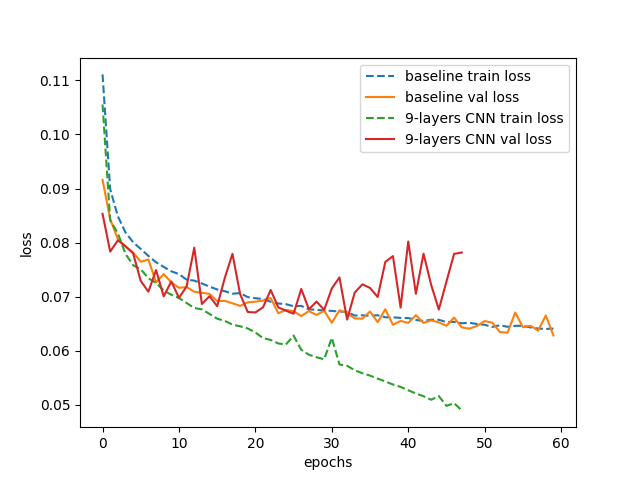
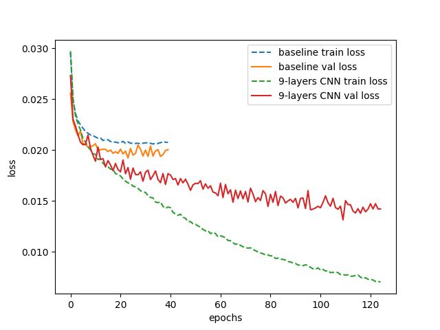

# An efficient and reproducible deep learning model for musical onset detection

The code aims to reproduce the results in the work:

**Towards an efficient and reproducible deep learning model for musical onset detection**
___

Below is a plot of the onset detection functions tested in the paper. Red lines in the Mel bands plot 
are the ground truth syllable onset positions, and those in the other plots are the detected onset positions by using 
peak-picking onset selection method.

For an interative code demo to generate the above plot,
please check our [jupyter notebook](https://goo.gl/Y5KAFC). You should be able to "open with" google colaboratory 
in you google drive, then "open in playground" to execute it block by block. 
The code of the demo is in the [colab_demo](https://github.com/musicalOnset-ismir2018/musicalOnset-ismir2018/tree/colab_demo) branch.



## Contents
[A. Code usage](#a-code-usage)
* [A.1 Install dependencies](#a1-install-dependencies)
* [A.2 Reproduce the experiment results with pretrained models](#a2-reproduce-the-experiment-results-with-pretrained-models)
* [A.3 General code for training data extraction](#a3-general-code-for-training-data-extraction)
* [A.4 Specific code for jingju and Böck datasets training data extraction](#a4-specific-code-for-jingju-and-böck-datasets-training-data-extraction)  
* [A.5 Train the model from the training data](#a5-train-the-model-from-the-training-data)  
    
[B. Supplementary information](#b-supplementary-information)
* [B.1 Pretrained models](#b1-pretrained-models)
* [B.2 Full results (precision, recall, F1)](#b2-full-results-precision-recall-f1)
* [B.3 Statistical significance calculation data](#b3-statistical-significance-calculation-data)
* [B.4 Loss curves (section 5.1 in the paper)](#b4-loss-curves-section-51-in-the-paper)

[License](#license)  

## A. Code usage
## A.1 Install dependencies
We suggest to install the dependencies in [`virtualenv`](https://virtualenv.pypa.io/en/stable/)
```bash
pip install -r requirements.txt
```
### A.2 Reproduce the experiment results with pretrained models
1. Download dataset: [jingju](https://drive.google.com/open?id=17mo5FuWyEHkCFRExKRLGXFcQk2n-jMEW); Böck dataset
is available on request (please send an email).
2. Change `nacta_dataset_root_path`, `nacta2017_dataset_root_path` in `./src/file_path_jingju_shared.py` to
your local jingju dataset path.
3. Change `bock_dataset_root_path` in `./src/file_path_bock.py` to your local Böck dataset path.
4. Download [pretrained models](https://drive.google.com/open?id=1DFB53P4Fz_ixoVFd9fMpW7nvstaK_wuA) and put
them into `./pretrained_models` folder.
4. Execute below command lines to reproduce jingju or Böck datasets results.`d` variable can be choose from 
`jingju` or `bock`; `-a` variable can be chosen from `baseline, relu_dense, no_dense, temporal, bidi_lstms_100, 
bidi_lstms_200, bidi_lstms_400, 9_layers_cnn, 5_layers_cnn, pretrained, retrained, feature_extractor_a, 
feature_extractor_b`. Please read the paper to decide which experiment result you want to reproduce:
```bash
python reproduce_experiment_results.py -d <string> -a <string> 
```
### A.3 General code for training data extraction
In case that you want to extract the feature, label and sample weights for your own dataset:
1. We assume that your training set audio and annotation are stored in folders `path_audio` and `path_annotation`.
2. Your annotation should conform to either jingju or Böck annotation format. Jingju annotation is stored in
[Praat textgrid file](http://www.fon.hum.uva.nl/praat/manual/TextGrid_file_formats.html). 
In our [jingju textgrid annotations](https://drive.google.com/drive/folders/17mo5FuWyEHkCFRExKRLGXFcQk2n-jMEW?usp=sharing),
two tiers are parsed: `line` and `dianSilence`; The former contains musical line (phrase) level onsets, and the latter
contains syllable level onsets. We assume that you also annotated your audio file in this kind of hierarchical format:
`tier_parent` and `tier_child` corresponding to `line` and `dianSilence`. Böck dataset is annotated at each onset time, 
you can check Böck dataset's annotation in this [link](https://github.com/CPJKU/onset_db),
3. Run below command line to extract training data for your dataset:
```bash
python ./trainingSetFeatureExtraction/training_data_collection_general.py --audio <path_audio> --annotation <path_annotation> --output <path_output> --annotation_type <string, jingju or bock> --phrase <bool> --tier_parent <string e.g. line> --tier_child <string e.g. dianSilence>
```
`--phrase` decides that if you want to extract the feature at file-level. If false is selected, 
you will get a single feature file for the entire input folder.

### A.4 Specific code for jingju and Böck datasets training data extraction
In case the you want to extract the feature, label and sample weights for the jingu and Böck datasets,
we provide the easy executable code for this purpose. This script is memory-inefficient. It heavily slowed down my 
computer after finishing the extraction. I haven't found the solution to solve this problem. If you do, please kindly 
send me an email to tell me how. Thank you.

1. Download dataset: [jingju](https://drive.google.com/open?id=17mo5FuWyEHkCFRExKRLGXFcQk2n-jMEW); Böck dataset
is available on request (please send an email).
2. Change `nacta_dataset_root_path`, `nacta2017_dataset_root_path` in `./src/file_path_jingju_shared.py` to
3. Change `bock_dataset_root_path` in `./src/file_path_bock.py` to your local Böck dataset path.
4. Change `feature_data_path` in `./src/file_path_shared.py` to your local output path.
4. Execute below command lines to extract training data for jingju or Böck datasets:
```bash
python ./training_set_feature_extraction/training_data_collection_jingju.py --phrase <bool>
```

```bash
python ./training_set_feature_extraction/training_data_collection_bock.py
```
`--phrase` decides that if you want to extract the feature at file-level. If false is selected, 
you will get a single feature file for the entire input folder. Böck dataset can only be processed
in phrase-level.
your local jingju dataset path.

### A.5 Train the model from the training data
Below scripts allow you to train the model from the training data which you should have already 
extracted in step A.3.

1. Extract jingju or Böck training data by following step A.3.
2. Execute below command lines to either train models. `-a` variable can be chosen from `baseline, relu_dense, 
no_dense, temporal, bidi_lstms_100, bidi_lstms_200, bidi_lstms_400, 9_layers_cnn, 5_layers_cnn, retrained, 
feature_extractor_a, feature_extractor_b`. `pretrained` model is not necessary to train explicitly because
it comes from the `5_layers_cnn` model of the other datasets.
```bash
python ./training_scripts/jingju_train.py -a <string, architecture> --path_input <string> --path_output <string> --path_pretrained <string, optional>
```

```bash
python ./training_scripts/bock_train.py -a <string, architecture> --path_input <string> --path_output <string> --path_cv <string> --path_annotation <string> --path_pretrained <string, optional>
```

## B. Supplementary information
### B.1 Pretrained models
[Pretrained models link](https://drive.google.com/open?id=1DFB53P4Fz_ixoVFd9fMpW7nvstaK_wuA)

These models have been pretrained on jingju and Böck datasets. You can put them into `./pretrained_models`
folder to reproduce the experiment results.
### B.2 Full results (precision, recall, F1)
[Full results link](https://drive.google.com/open?id=100RKdVYwsW_WDyd6aDs0YUic84hEdwBl)

In jingju folder, you will find two result files for each model. The files with the postfix name 
`_peakPickingMadmom` are the results of peak-picking onset selection method, and those with `_viterbi_nolabel` are
score-informed HMM results. In each file, only the first 5 rows are related to the paper, others are computed by using
other evaluation metrics.

You can download and put these files into `./statistical_significance/data` folder. We also provide code for 
the data parsing and p-value calculation. Please check `ttest_experiment.py` and `ttest_experiment_transfer.py` for
the details.

`_peakPickingMadmom` first 5 rows format:

|              onset selection method             |
|:-----------------------------------------------:|
| best threshold searched on the holdout test set |
|                    Precision                    |
|                      Recall                     |
|                    F1-measure                   |

`_viterbi_nolabel` first 5 rows format:

|                  onset selection method                  |
|:--------------------------------------------------------:|
| whether we evaluate label of each onset (no in our case) |
|                         Precision                        |
|                          Recall                          |
|                        F1-measure                        |


In Böck folder, there is only one file for each model, and its format is:

| best threshold searched on the holdout test set |
|:-----------------------------------------------:|
|           Recall Precision F1-measure           |
### B.3 Statistical significance calculation data
[link](https://drive.google.com/open?id=1B1SroQRdsqOjKexA6ICinr3hbPk_jkdZ)

Evaluation results of 5 time training models for jingju dataset and 8 folds results for Böck dataset.  

### B.4 Loss curves (section 5.1 in the paper)
These loss curves aim o show the overfitting of Bidi LSTMs 100 and 200 models
 for Böck dataset and 9-layers CNN for both datasets.

Böck dataset Bidi LSTMs 100 losses (fold 2)



Böck dataset Bidi LSTMs 200 losses (fold 3)


Böck dataset Bidi LSTMs 400 losses (fold 0)


Böck dataset baseline and 9-layers CNN losses (2nd model)


Jingju dataset baseline and 9-layers CNN losses (2nd model)


## License
### Code
This program is free software: you can redistribute it and/or modify
it under the terms of the GNU General Public License as published by
the Free Software Foundation, either version 3 of the License, or
(at your option) any later version.

This program is distributed in the hope that it will be useful,
but WITHOUT ANY WARRANTY; without even the implied warranty of
MERCHANTABILITY or FITNESS FOR A PARTICULAR PURPOSE.  See the
GNU General Public License for more details.

You should have received a copy of the GNU General Public License
along with this program.  If not, see <http://www.gnu.org/licenses/>.

### Datasets, pretrained models and any other data used in this work
Creative Commons Attribution-NonCommercial 4.0